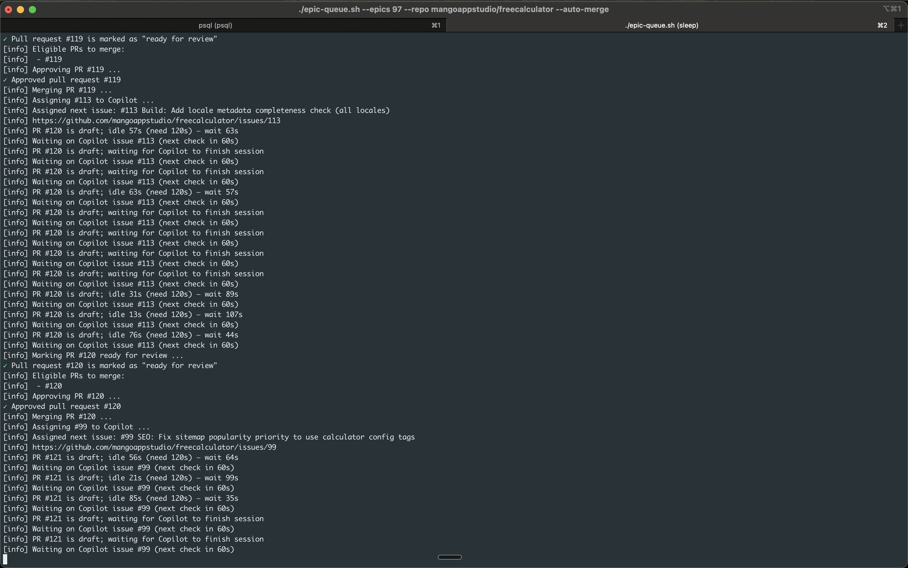

# Epic Queue

> Automate epic-driven development with GitHub Copilot (or any coding agent)

Turn epic checklists into an automated queue: assign issues sequentially, auto-merge completed PRs, and keep your agent working non-stop.



## Quick Start

```bash
# Run once to assign next issue and merge completed PRs
./epic-queue.sh --epics 123 --repo owner/repo --auto-merge

# Watch mode: continuous automation (recommended)
./epic-queue.sh --epics 123 --repo owner/repo --auto-merge --watch
```

## What it does

1. **Reads your epic checklist** — finds unchecked items like `- [ ] #123 — Add login page`
2. **Assigns issues sequentially** — waits for Copilot to finish before assigning the next one
3. **Auto-merges completed PRs** — detects when Copilot's session ends, verifies idle time, approves & merges
4. **Repeats** — works through your entire epic checklist hands-free

📖 **[See example epic structure →](EXAMPLE_EPIC.md)**

## Why this exists

I typically brainstorm features with Claude or Copilot locally, create an implementation plan, then convert it into GitHub issues organized in an epic. Previously, I'd manually assign tickets to Copilot one-by-one, review each PR, and merge before moving to the next. This script automates that entire flow — letting you run it in the background while Copilot works through your checklist.

**Some work i managed to automate using this queue:**

- **Large migrations** — Migrated 80+ Lambda functions to a single Express.js app
- **Component library swaps** — Converted entire codebase from Material-UI to Tailwind
- **Framework upgrades** — Breaking down major version bumps into manageable chunks
- **Tech debt sprints** — Systematically working through refactoring tasks

While tools like Mission Control and others exist, this lightweight script gives you full control over the GitHub workflow without extra dependencies.

## Installation

**Requirements:** [GitHub CLI](https://cli.github.com/) (`gh`) and `jq`

```bash
# Clone and make executable
git clone https://github.com/yourusername/epic-queue.git
cd epic-queue
chmod +x epic-queue.sh

# Optional: add to PATH
ln -s $(pwd)/epic-queue.sh ~/.local/bin/epic-queue
```

## Examples

**Basic usage:**

```bash
./epic-queue.sh --epics 97 --repo myorg/myrepo --auto-merge --watch
```

**Multiple epics (priority order):**

```bash
./epic-queue.sh --epics 210,211,212 --repo myorg/myrepo --auto-merge --watch
```

**Dry run (test without making changes):**

```bash
./epic-queue.sh --epics 97 --repo myorg/myrepo --auto-merge --dry-run
```

**Custom merge settings:**

```bash
./epic-queue.sh --epics 97 --repo myorg/myrepo \
  --auto-merge \
  --merge-method rebase \
  --min-idle-seconds 300
```

## Key Features

- ✅ **Copilot session detection** — waits for `copilot_work_finished` event before merging
- ✅ **Idle time verification** — ensures PRs are stable (default: 120s)
- ✅ **Sequential issue assignment** — prevents overwhelming the agent with multiple tasks
- ✅ **Branch cleanup** — auto-deletes merged branches
- ✅ **Generic** — works with any GitHub repo, epic, and coding agent

## Options

| Flag                    | Description                        | Default     |
| ----------------------- | ---------------------------------- | ----------- |
| `--epics N1,N2,...`     | Epic issue numbers (required)      | -           |
| `--repo owner/repo`     | Target repository                  | Auto-detect |
| `--auto-merge`          | Enable auto-merge (recommended)    | `false`     |
| `--watch`               | Continuous mode                    | `false`     |
| `--assignee LOGIN`      | Issue assignee                     | `Copilot`   |
| `--min-idle-seconds N`  | Merge after N seconds idle         | `120`       |
| `--merge-method METHOD` | `squash`, `merge`, or `rebase`     | `squash`    |
| `--dry-run`             | Preview without changes            | `false`     |

Run `./epic-queue.sh --help` for all options.

## How It Works

**Auto-merge flow:**

1. Finds open PRs referencing epic issues
2. Checks if Copilot's session has finished (`copilot_work_finished` event)
3. Verifies PR has been idle (no new commits) for configured time
4. Marks draft PRs as ready for review
5. Approves with your GitHub account
6. Merges and deletes the branch

**Issue assignment:**

- Only assigns the next issue if assignee (Copilot) isn't already working on something
- Respects epic priority order
- Skips closed issues

## Tips

**For non-Copilot agents:**

```bash
./epic-queue.sh --epics 123 --repo owner/repo \
  --assignee your-bot-name \
  --pr-author your-bot-author \
  --pr-branch-prefix bot-prefix/
```

**Environment variables (avoid repeating flags):**

```bash
export QUEUE_REPO=”owner/repo”
export QUEUE_EPICS=”210,211”
export QUEUE_ASSIGNEE=”Copilot”
```

## License

MIT
